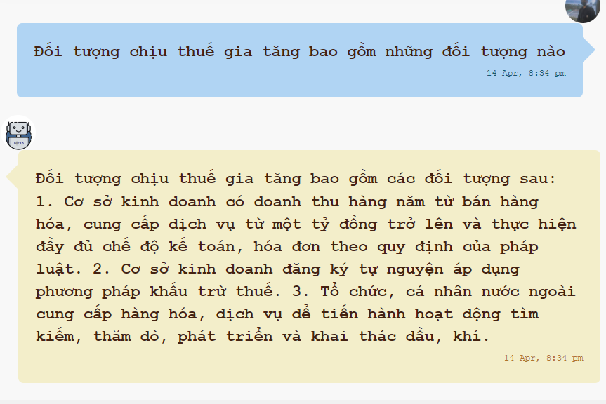
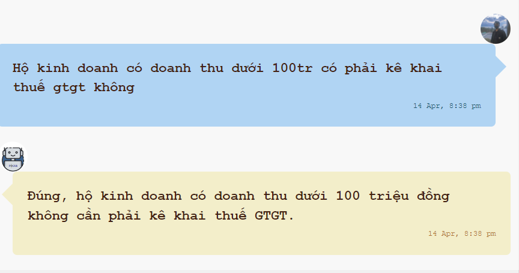
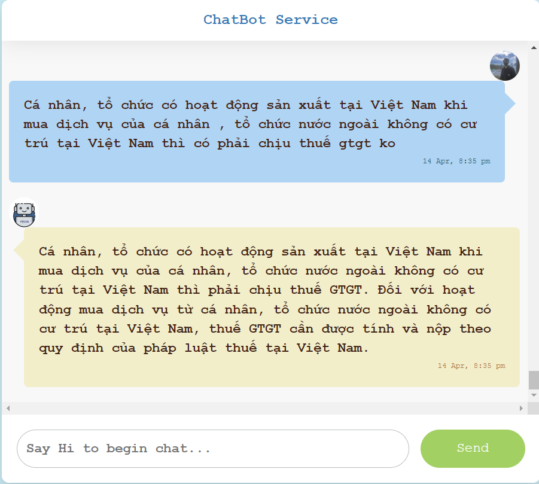

# Chatbot-answer-law-documents
<div align="center">
    <a href="./">
        
        
          
    </a>
</div>

## Table of Contents
- [Overview](#Overview)
- [Getting Started](#Getting-Started)
- [Run application](#Run-application)
- [Result](#Result)
- [Citation](#Citation)
- [Acknowledgement](#Acknowledgements)

## Overview
A simple chatbot project, using GPT model to answer VietNamese 's VAT taxation. In this project, I used
- Embedding model: "bkai-foundation-models/vietnamese-bi-encoder"
  I did many experiments to choose embedding model, and generated answers using vietnamese-bi-encoder embedding model is more revelant to the queries than other vietnamese ones.
- Chunk size/chunk overlap: 512/40
- Search method: FAISS
- 
## Getting Started

To install chatbot, follow these steps:

1. Install uv - Python Package manager
link: https://github.com/astral-sh/uv


2. Clone the my repository
<details><summary> <b>Expand</b> </summary> 

``` shell 
git clone git@github.com:BaHuy15/Chatbot-answer-law-documents.git
```                                   
</details>  

3. Create a virtual environment and install the required dependencies 
(you can use any virtual environment manager):
<details>

``` shell 
uv venv

# On macOS and Linux.
source .venv/bin/activate

# On Windows.
.venv\Scripts\activate

uv pip install -r requirements.txt
```                                   
</details>

4. Setup API keys:
Put your key in config.toml file


## Run application
``` shell 
python main.py  
```
Visit this link to see result: http://localhost:8080/                
FastAPI Endpoint: http://localhost:8080/docs                                               

